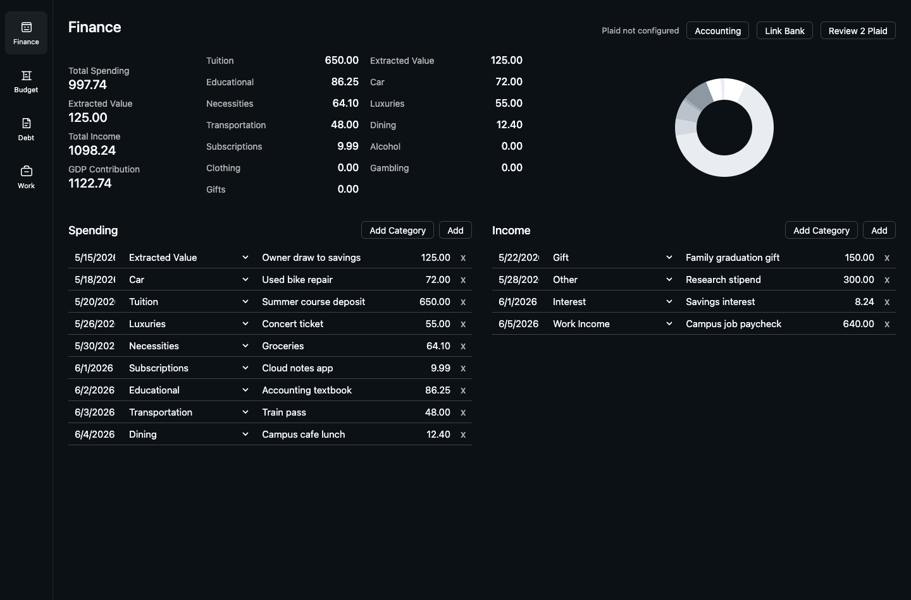
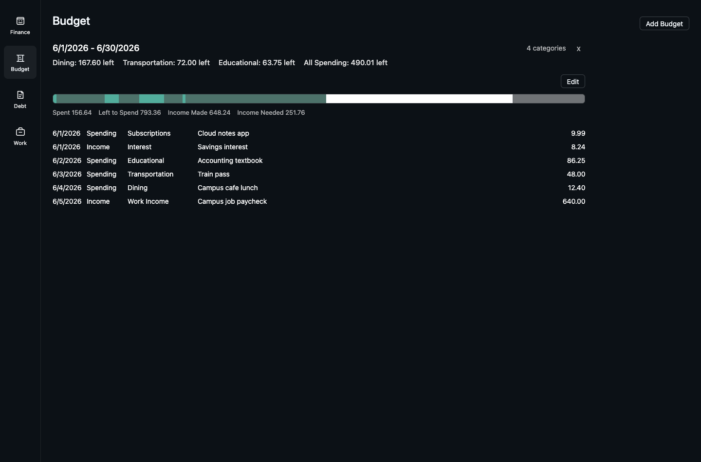
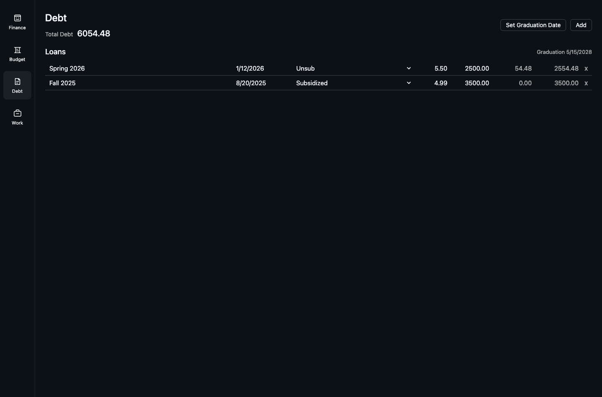

# Life Portal

Local-first personal finance dashboard with spending, income, budgets, debt tracking, Plaid import, and SQLite storage.

All screenshots below use fake demo data.

## Screenshots







## Run

```sh
cp .env.example .env
npm run dev
```

Open `http://127.0.0.1:3000`.

The app creates `data/life-portal.sqlite` on first run. Keep `.env` and `data/` private.

## Plaid

Add your Plaid keys to `.env`:

```sh
PLAID_ENV=sandbox
PLAID_CLIENT_ID=your_client_id
PLAID_SECRET=your_secret
PLAID_CLIENT_USER_ID=life-portal-local-user
```

Use `PLAID_ENV=sandbox`, `development`, or `production` to match your Plaid secret.

In the app:

1. Open Finance.
2. Click `Link Bank`.
3. Complete Plaid Link.
4. New transactions enter a review queue.
5. Click `Review Plaid` to post each transaction into spending or income.

Plaid items and queued transactions are stored locally in SQLite. Do not commit real `.env` values or database files.
