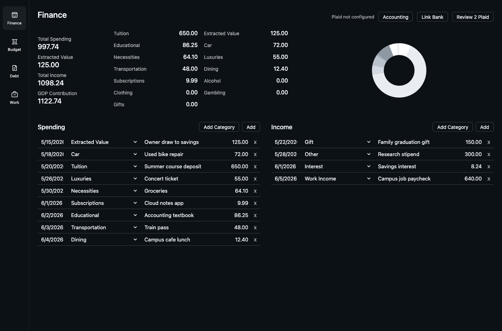
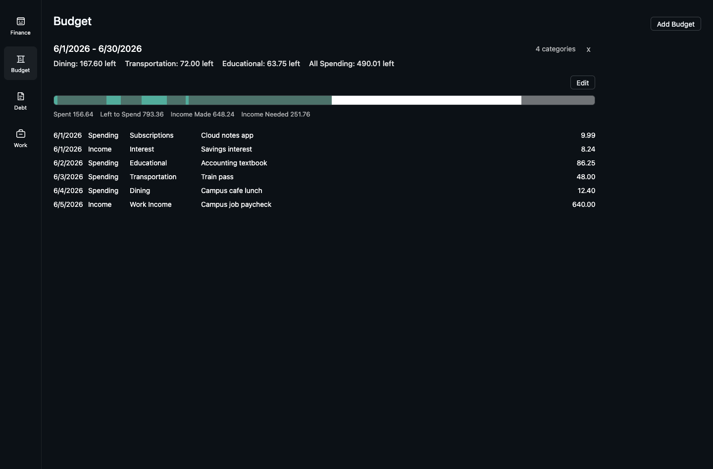
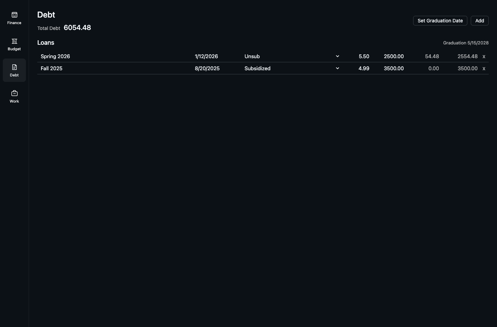

# Life Portal

Local-first personal finance dashboard with spending, income, budgets, debt tracking, Plaid import, and SQLite storage.

All screenshots below use fake demo data.

## Screenshots







## Run

```sh
cp .env.example .env
npm run dev
```

Open `localhost:3000`.

The app creates `data/life-portal.sqlite` on first run. Keep `.env` and `data/` private.

## macOS menu bar app

Build the lightweight native launcher:

```sh
chmod +x scripts/build-macos-app.sh
scripts/build-macos-app.sh
```

Open `dist/Life Portal.app`. It starts the local server, opens Life Portal in
the default browser, stays available from its Dock icon, and adds an SF Symbol
to the menu bar. Clicking the Dock icon again reopens the portal. Use the menu
to open the portal or choose **Stop Server & Quit**. The built app bundles the
server and web assets while keeping private runtime files in
`~/Library/Application Support/Life Portal`.

## Plaid

Add your Plaid keys to `.env`:

```sh
PLAID_ENV=sandbox
PLAID_CLIENT_ID=your_client_id
PLAID_SECRET=your_secret
PLAID_CLIENT_USER_ID=life-portal-local-user
```

Use `PLAID_ENV=sandbox`, `development`, or `production` to match your Plaid secret.

In the app:

1. Open Finance.
2. Click `Link Bank`.
3. Complete Plaid Link.
4. New transactions enter a review queue.
5. Click `Review Plaid` to post each transaction into spending or income.

Plaid items and queued transactions are stored locally in SQLite. Do not commit real `.env` values or database files.
