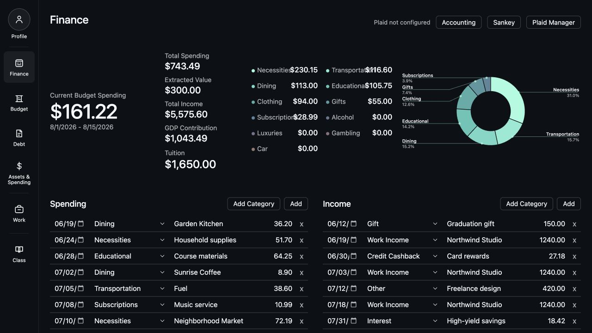
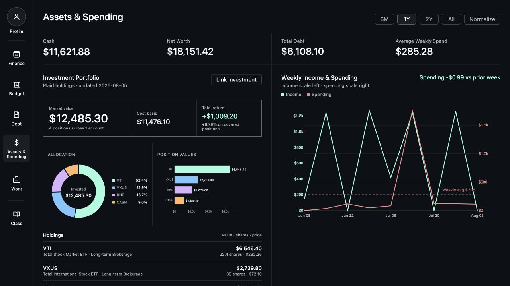
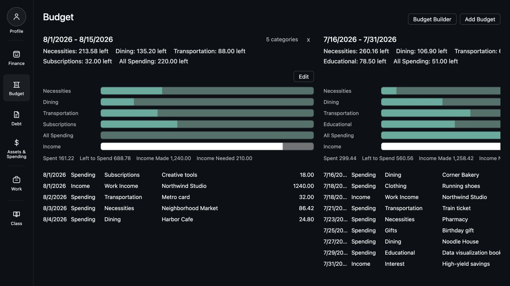
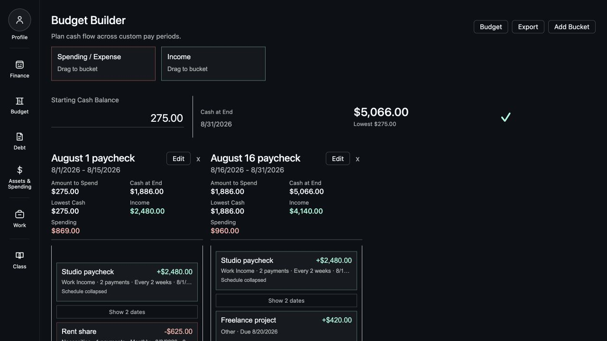
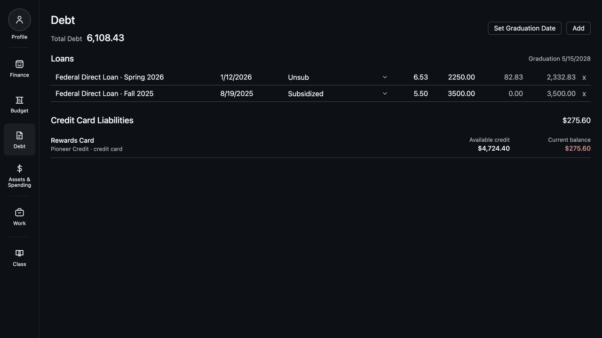
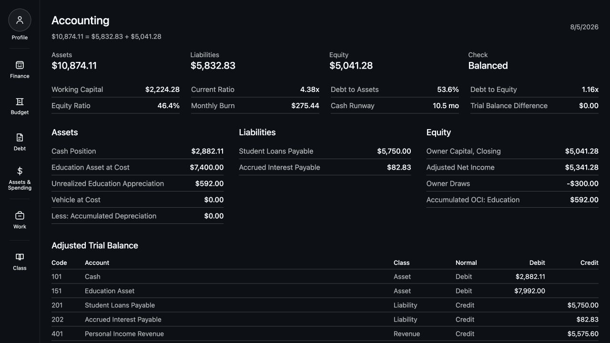
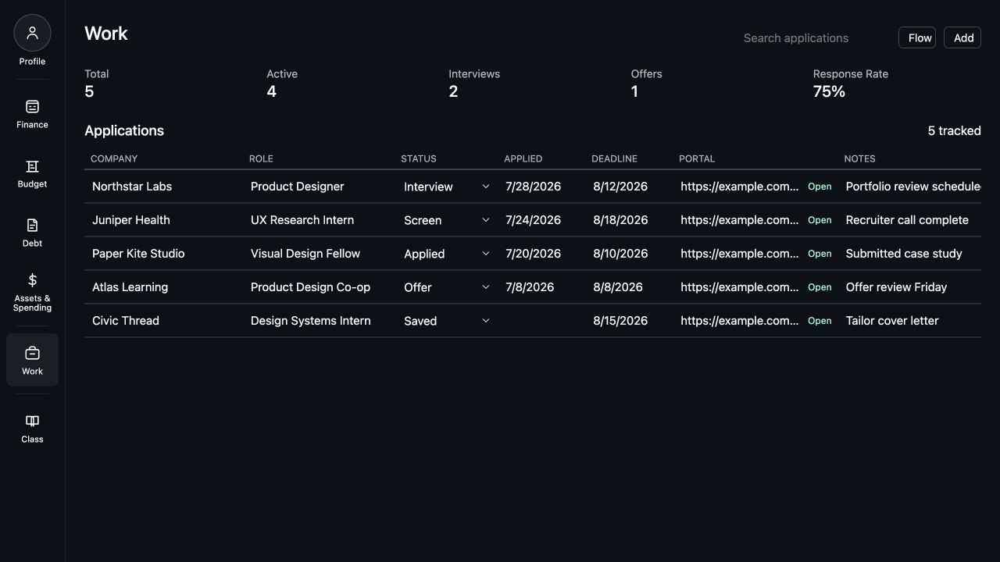
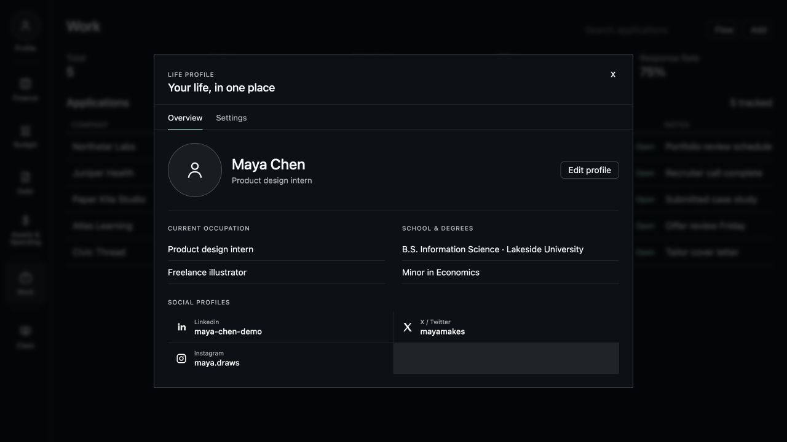

<p align="center">
  
</p>

<h1 align="center">Lifepane</h1>

<p align="center">
  A local-first dashboard for understanding your money, planning cash flow, tracking work, and keeping the important parts of life in one clear view.
</p>

Lifepane stores its primary data in local SQLite, serves a lightweight browser interface, and includes a native macOS launcher. Plaid can optionally import bank transactions, balances, liabilities, and investment holdings.

## Features

- Spending and income ledgers with category analytics, weekly trends, and Sankey cash-flow views
- Period budgets plus a drag-and-drop cash-flow builder with recurring items
- Assets, net worth, connected accounts, investment allocation, cost basis, and return tracking
- Student-loan interest, graduation-aware debt projections, and credit-card liabilities
- Accounting equation, ratios, trial balance, statements, adjustments, and journal entries
- Work-application pipeline with deadlines, status history, search, and flow visualization
- Personal profile with occupations, education, social links, preferences, and photo cropping
- Optional Plaid review queue with local caching and explicit transaction approval

## Screenshots

Every screenshot uses a separate fake dataset. No personal records, credentials, or production Plaid data are included.

<table>
  <tr>
    <td width="50%">
      
      <br><strong>Finance overview</strong><br>
      Follow the current budget, income, categorized spending, extracted value, tuition, and editable ledgers from one screen.
    </td>
    <td width="50%">
      
      <br><strong>Assets &amp; spending</strong><br>
      Compare cash, net worth, debt, weekly spending, account balances, portfolio allocation, cost basis, and total return.
    </td>
  </tr>
  <tr>
    <td width="50%">
      
      <br><strong>Budgets</strong><br>
      Review multiple pay periods with category limits, progress bars, matching transactions, and remaining income requirements.
    </td>
    <td width="50%">
      
      <br><strong>Budget builder</strong><br>
      Arrange income and expenses into custom buckets, expand recurring schedules, and see projected cash at the end of the plan.
    </td>
  </tr>
  <tr>
    <td width="50%">
      
      <br><strong>Debt</strong><br>
      Track principal, rates, accrued interest, subsidy rules, graduation timing, and connected credit-card balances.
    </td>
    <td width="50%">
      
      <br><strong>Accounting</strong><br>
      Translate personal activity into assets, liabilities, equity, ratios, an adjusted trial balance, statements, and journal entries.
    </td>
  </tr>
  <tr>
    <td width="50%">
      
      <br><strong>Work applications</strong><br>
      Keep roles, deadlines, portals, notes, pipeline status, interviews, offers, and response-rate metrics together.
    </td>
    <td width="50%">
      
      <br><strong>Life profile</strong><br>
      Personalize Lifepane with occupations, degrees, social profiles, a cropped photo, a default section, and reduced-motion settings.
    </td>
  </tr>
</table>

## Run locally

```sh
cp .env.example .env
npm install
npm run dev
```

Open [http://localhost:3000](http://localhost:3000).

The app creates `data/life-portal.sqlite` on first run. The legacy filename is retained so existing Life Portal installations keep their data after upgrading to Lifepane. Keep `.env` and `data/` private.

## macOS app

Build the lightweight native launcher:

```sh
chmod +x scripts/build-macos-app.sh
scripts/build-macos-app.sh
```

Open `dist/Lifepane.app`. It starts the local server, opens Lifepane in the default browser, stays available from its Dock icon, and adds an SF Symbol to the menu bar. Clicking the Dock icon again reopens the app. Use the menu to open Lifepane or choose **Stop Server & Quit**.

Private runtime files live in `~/Library/Application Support/Lifepane`. During the first renamed build, the launcher safely copies an existing `.env` and SQLite database from `~/Library/Application Support/Life Portal` when Lifepane does not already have them.

## Plaid

Add your Plaid keys to `.env`:

```sh
PLAID_ENV=sandbox
PLAID_CLIENT_ID=your_client_id
PLAID_SECRET=your_secret
PLAID_CLIENT_USER_ID=lifepane-local-user
```

Use `PLAID_ENV=sandbox`, `development`, or `production` to match your Plaid secret.

In Lifepane:

1. Open **Finance** and choose **Plaid Manager**.
2. Link a bank or investment account.
3. Sync transactions into the local review queue.
4. Approve each transaction into spending or income, or skip it.

Plaid items, cached account data, holdings, and queued transactions remain in the local SQLite database. Never commit real `.env` values or database files.
